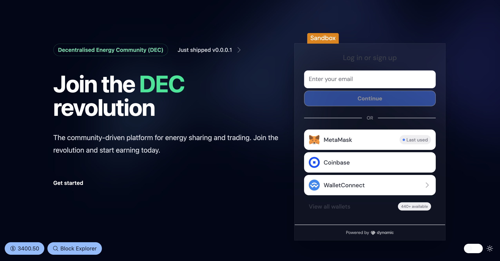

# Decentralized Energy Community

> Project developed during ETHGlobal Brussels 2024 hackathon

## Overview
Energy Community is a project for people. We allow communities to trade their electricity, 
regulate production and consumption. P2P deals without third parties. 
The DEC encourages participants to take a part in energy transitions responsibly

## Links

[ETHGlobal project page](https://ethglobal.com/showcase/energy-community-dao-d2g3p)

[Presentation](https://www.canva.com/design/DAGK2lys9Mg/QSazmpsdY6cth-Hej7Ga4A/edit?utm_content=DAGK2lys9Mg&utm_campaign=designshare&utm_medium=link2&utm_source=sharebutton)
